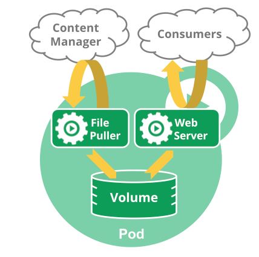
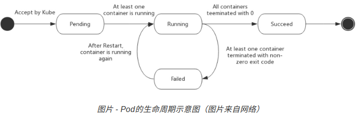

## 什么是 Pod

Pod 是kubernetes 中可以创建的最小部署单元。由一个或多个容器组成，它们共享容器存储、网络和运行配置项。Pod中的容器总是被同时调度，有共同的运行环境。Pod 中的容器共享IP地址和端口号，它们之间可以通过localhost 互相发现。




## Pod 的生命周期

### Pod phase

Pod 的status 字段下有一个phase 字段，包含以下的值：
- 挂起（Pending）： Pod 已经被k8s系统接受，但有容器尚未创建。例如正在下载镜像或者正在调度。
- 运行中（Running）： Pod 已经绑定到了一个node 上，Pod 中的所有容器都已被创建。至少有一个容器正在运行，或出于启动状态。
- 成功（Succeeded）： 所有容器都因成功运行而终止且不会再重启。
- 失败（Failed）： 所有容器都已终止，且至少有一个容器是因为失败而终止。也就是说容器以非0状态退出或被系统终止。
- 未知(Unknow)： 因为某些原因无法取得 Pod 的状态，通常是因为与 Pod 所在主机通信失败。

Pod的生命周期



### Pod 状态

PodStatus 对象下有一个PodCondition 数组。数组的每个元素都包含type 字段和status 字段。type 可能的值有PodScheduled、Ready、Initialized、Unschedulable和ContainersReady，status 可能的值有True、False和Unknown。

### 容器探针

探针是由kubelet 对容器执行的定期诊断。分为livenessProbe（存活）和readinessProbe（就绪）两种探针。
- livenessProbe（存活）： 指示容器是否正在运行。如果存活探测失败，kubelet会杀死容器，并且容器会受到重启策略（restartPolicy）的影响。
- readinessProbe（就绪）： 指示容器是否已经准备好接受服务请求。如果就绪探测失败，会在与Pod匹配的所有Service 中删除该Pod的IP地址。

> 容器存活不等于容器就绪。容器虽然正在运行，但容器内的主进程不一定可以提供对外服务。

要执行诊断，Kubelet会调用容器实现的Handler。有三种Handler：
- ExecAction: 在容器内执行指定命令。如果命令退出时返回码为0，则认为诊断成功。
- TCPSocketAction: 对指定端口上的容器IP地址执行TCP检查。如果端口打开，则认为成功。
- HTTPGetAction: 对指定端口和路径上的容器的IP执行HTTP GET 请求。如果status code 大于200且小于400， 则认为成功。

livenessProbe 示例：

```yaml
apiVersion: v1
kind: Pod
metadata:
  labels:
    test: liveness
  name: liveness-http
spec:
  containers:
  - args:
    - /server
    image: k8s.gcr.io/liveness
    livenessProbe:
      httpGet:
        # when "host" is not defined, "PodIP" will be used
        # host: my-host
        # when "scheme" is not defined, "HTTP" scheme will be used. Only "HTTP" and "HTTPS" are allowed
        # scheme: HTTPS
        path: /healthz
        port: 8080
        httpHeaders:
        - name: X-Custom-Header
          value: Awesome
      initialDelaySeconds: 15
      timeoutSeconds: 1
    name: liveness
```

